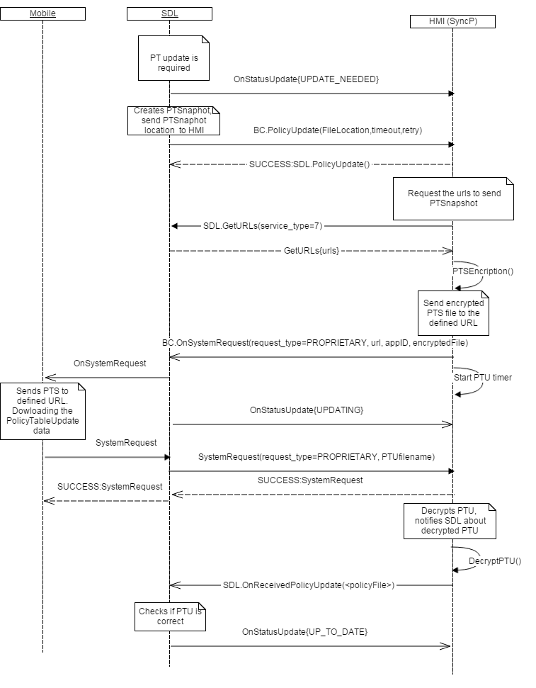

# HMI Policy Table Update using vehicle modem

* Proposal: [SDL-NNNN](NNNN-hmi-ptu-support.md)
* Author: [SDL Developer](https://github.com/kshala-ford)
* Status: **Awaiting review**
* Impacted Platforms: [Core / HMI]

## Introduction

This proposal describes an enhanced policy table update PTU sequence where the IVI system sends the policy table snapshots (PTS) directly to the policy server using the in-vehicle modem and returns a policy table update (PTU) back to SDL Core without using any `SystemRequest` RPC.

## Motivation

According to the HMI documentation on [smartdevicelink.com](https://smartdevicelink.com/en/guides/hmi/sdl/onreceivedpolicyupdate/) SDL Core doesn't expect the system to be capable of a direct policy update using the system (in-vehicle) modem. See the following sequence copied from above documentation

 As of today SDL Core is waiting for an HMI `OnSystemRequest` notification so that SDL Core can request a connected mobile app to transport the PTS. However, the requirements how to implement the PTU flow don't specifically say that `OnSystemRequest` is required before HMI sends `OnReceivedPolicyUpdate`. Technically SDL Core should already be able to support the proposed feature. This proposal is meant to officially support the proposed feature.

## Proposed solution

The solution is to add an additional PTU flow to the HMI documentation and make sure SDL Core can support this new flow. This flow should be optional for SDL integrators if an in-vehicle modem exist. The integration of an in-vehicle modem should look as followed:

Different to the current flow, HMI does not send an `OnSystemRequest` to SDL Core. Instead the (optionally encrypted) PTS is delivered to the policy server using the the modem. The HMI waits for a response by the policy server and provides the (decrypted if necessary) PTU back to SDL Core using `OnReceivedPolicyUpdate`.

In case the policy backend cannot be reached or doesn't by the modem the HMI should still be able to decide using a connected mobile application for the delivery.

The flow show a possible scenario where the policy server response including the PTU wasn't received by the in-vehicle modem. There are many more reasons for a failure:
- The PTS wasn't successfully send by the in-vehicle modem
- The policy server ignored the request for whatever reason (invalid request; potential abuse attempt)
- The policy server responds with a non 200 result code
- The policy server returns an invalid PTU (e.g. couldn't decrypt; potential abuse attempt)

For any reason the HMI should still be allowed to send an `OnSystemRequest` notification to SDL Core to forward it to a connected mobile application.

## Potential downsides

There's a downside for the PTU flow which is further delayed if anything goes wrong. However, this delay could also happen to the current approach as well.

For SDL integrators the additional traffic can be an issue which depends on the traffic cost. As this feature is optional every integrator is free to choose the best option for a policy table update. Not only can an integrator choose to not implement this new flow, it is also possible to fall back to use a connected mobile application if the modem traffic reached a certain threshold.

## Impact on existing code

Existing code should not be affected. SDL Core should be able to support this feature. This proposal is to make this flow officially supported.

## Alternatives considered

No other alternatives are considered
